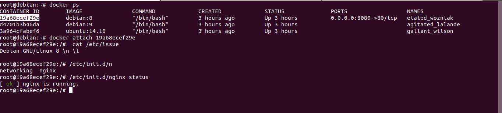
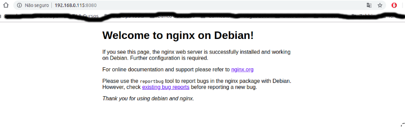

## Um pouquinho de Docker

Pessoal, nessa documentação serei bem direto ao ponto, "na prática mesmo" para que a galera entenda de forma rápida, os comandos sobre essa tecnologia que está facilitando muito os trabalhos dos Dev e Ops.


1) Para visualizarmos a versão do Docker instalado em nosso sistema, basta usar o comando `docker --version`
```
docker --version 
Docker version 18.06.1-ce, build e68fc7a
```
2) Para ver mais informações, basta digitar o comando `docker info`
```
docker info 
Containers: 33
 Running: 3
 Paused: 0
 Stopped: 30
```
3) Agora vamos testar a instalação do Docker:
```
docker run hello-world

Unable to find image 'hello-world:latest' locally
latest: Pulling from library/hello-world
d1725b59e92d: Already exists 
Digest: sha256:0add3ace90ecb4adbf7777e9aacf18357296e799f81cabc9fde470971e499788
Status: Downloaded newer image for hello-world:latest

Hello from Docker!
This message shows that your installation appears to be working correctly.

To generate this message, Docker took the following steps:
 1. The Docker client contacted the Docker daemon.
 2. The Docker daemon pulled the "hello-world" image from the Docker Hub.
    (amd64)
 3. The Docker daemon created a new container from that image which runs the
    executable that produces the output you are currently reading.
 4. The Docker daemon streamed that output to the Docker client, which sent it
    to your terminal.

To try something more ambitious, you can run an Ubuntu container with:
 $ docker run -it ubuntu bash

Share images, automate workflows, and more with a free Docker ID:
 https://hub.docker.com/

For more examples and ideas, visit:
 https://docs.docker.com/get-started/
```

4) Mostrando as nossas images que já temos no sistema:
```
docker images

REPOSITORY            TAG                 IMAGE ID            CREATED             SIZE
debian                latest              4879790bd60d        3 days ago          101MB
mamau/apache          1.0                 175aa2628f40        10 days ago         216MB
amaury/nginx-debian   1.0                 e0cc9621b031        11 days ago         206MB
nginx                 latest              62f816a209e6        12 days ago         109MB
ubuntu                16.04               4a689991aa24        4 weeks ago         116MB
ubuntu                14.04               f216cfb59484        4 weeks ago         188MB
ubuntu                18.04               ea4c82dcd15a        4 weeks ago         85.8MB
ubuntu                latest              ea4c82dcd15a        4 weeks ago         85.8MB
debian                8                   efdec82af25a        4 weeks ago         127MB
centos                latest              75835a67d134        5 weeks ago         200MB
hello-world           latest              4ab4c602aa5e        2 months ago        1.84kB
```

- Outro comando interessante é o `docker ps` que mostra os containers que estão ativos no sistema, veja abaixo:
```
docker ps
CONTAINER ID    IMAGE         COMMAND          CREATED             STATUS              PORTS               NAMES
7132f62e1337    debian        "bash"           2 hours ago         Up 2 hours                              quirky_kare
b9806160cd64    ubuntu        "/bin/bash"      2 hours ago         Up 2 hours                              practical_jang
75fcd79ff7fa    ubuntu:18.04  "/bin/bash"      24 hours ago        Up 24 hours                             goofy_varahamihira
```


## Agora, um exemplo básico usando Docker

#### Para esse primeiro contato com Docker, fiz a criação de um container com Debian 8, instalei o webserver Nginx, para mostrar a execução da página default do Nginx de dentro do container, ficou massa:




